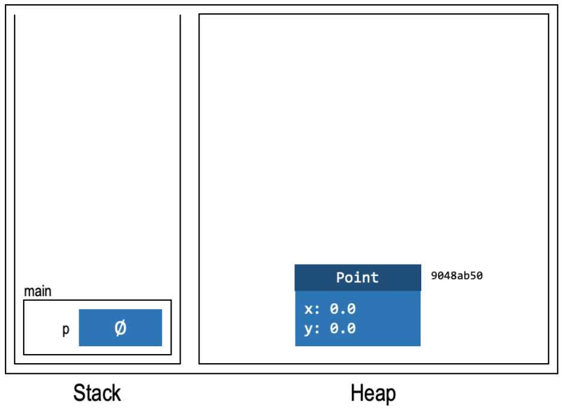
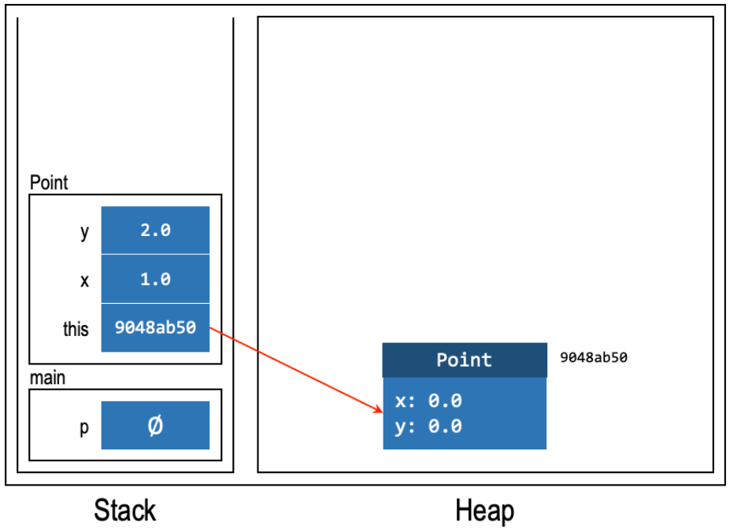
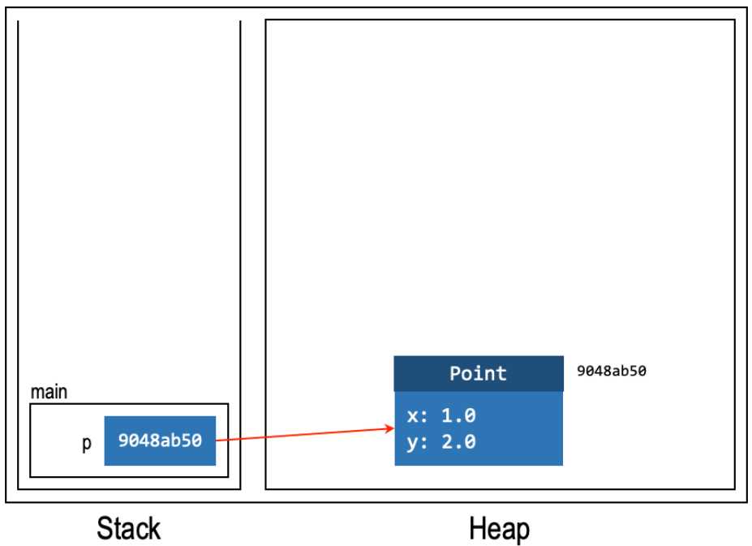
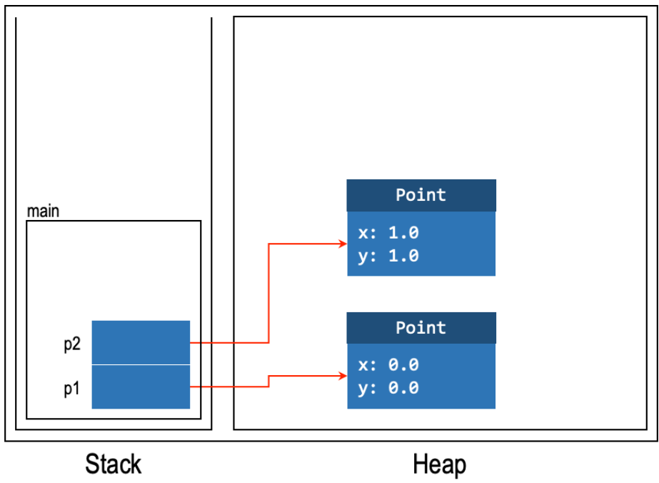
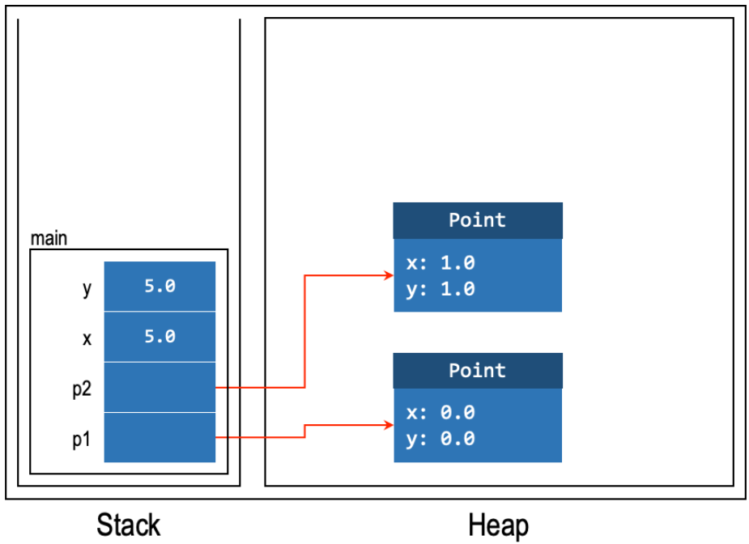
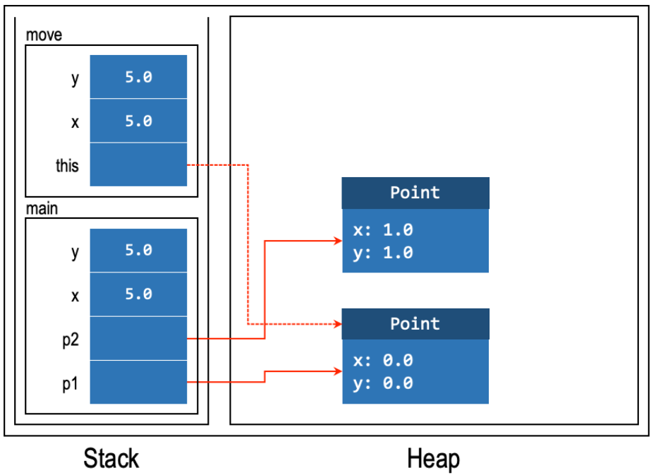

# Heap and Stack Summary

## JVM Memory Regions
- Method area: Stores method code
- Metaspace: Stores class metadata
- Heap: Stores dynamically allocated objects
- Stack: Stores local variables and call frames

## Stack
- Holds local variables (not instance or class fields)
- Organized into call frames (one per method call)
- Follows a Last-In-First-Out (LIFO) order
- Each call frame contains:
    - Local variables
    - Method parameters
    - Reference to `this` (for non-static methods)
- A new frame is created when a method is called and removed when the method finishes

## Heap
- Stores objects created with `new`
- Objects can be shared between methods and variables
- Each object contains:
    - Class name
    - Instance fields and their values
    - Captured variables (for nested classes)
- No LIFO restriction; objects can outlive the methods that created them

## Constructor Example
```java
Point p;                  // Stack: p (uninitialized)
p = new Point(1, 2);      // Heap: new Point object
                          // Stack: p now references the Point
                          // Constructor call creates a new call frame
```
=== "Declare Point variable on stack (null placeholder)"
    
=== "Allocate Point object on heap"
    
=== "Invoke Constructor (new Point(1, 2))"
    
=== "Constructor completes (pop frame)"
    
=== "Assign object reference to p"
    

- The symbol ∅ indicates an uninitialized variable
- Each constructor call creates a new stack frame containing:
    - The `this` reference
    - Constructor parameters
    - Local variables

## Method Call Example
```java
class Point {
  private double x;
  private double y;

  public Point(double x, double y) {
    this.x = x;
    this.y = y;
  }

  public void move(double x, double y) {
    this.x = x;
    this.y = y;
  }
}

Point p1 = new Point(0, 0);
Point p2 = new Point(1, 1);
double x = 5;
double y = 5;
p1.move(x, y);
```
=== "After Lines 1-2: p1 and p2 objects created"
    
=== "After Lines 3-4: x and y primitives assigned"
    
=== "Line 5: move method invoked"
    
=== "Method completes, frame poped, p1 updated"
    

- Each method call creates a new stack frame
- The frame is destroyed when the method returns
- Method parameters are copied into the new frame

## Best Practices
- Understand the lifetime of objects and variables
- Be aware of when objects are shared or referenced
- Know the difference between stack and heap allocation
- Clean up references when no longer needed
- Be mindful of memory usage patterns
